<p align="center">
  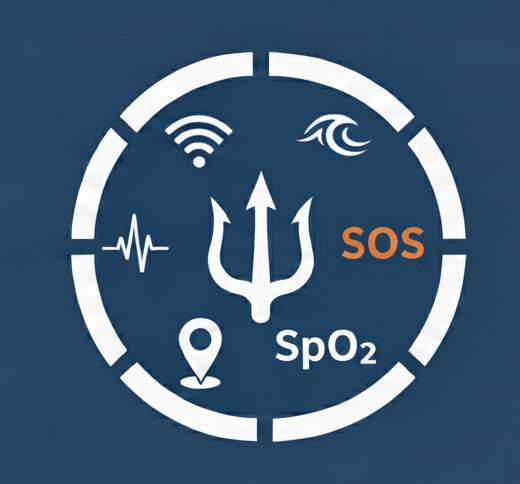
</p>

# TRIDENT - Integrated Disaster Response & Rescue Ecosystem

[](https://opensource.org/licenses/MIT)
[](https://www.python.org/downloads/)
[](https://flask.palletsprojects.com/)
[](https://platformio.org/)

This is an integrated disaster rescue ecosystem that enables real-time situational awareness, predictive risk analysis, and priority classification. It combines a multi-sensor wearable (ESP32, MAX30102, GSR, MPU6050, NEO-6M GPS, buzzer) and an underwater ROV (Arduino Uno, 4x thrusters, LiPo) with an AI-powered Flask central orchestrator.

## 🎥 Demonstration

Watch the multi-functional health & safety wearable in action:

<video src="https://github.com/harshitworkmain/trident/raw/main/assets/videos/wearable-demo.mp4" controls="controls" style="max-width: 100%;"></video>

*(Note: Video playback might require viewing on standard GitHub web. A direct download or raw viewing might be necessary depending on your device.)*

## 🏗️ System Architecture

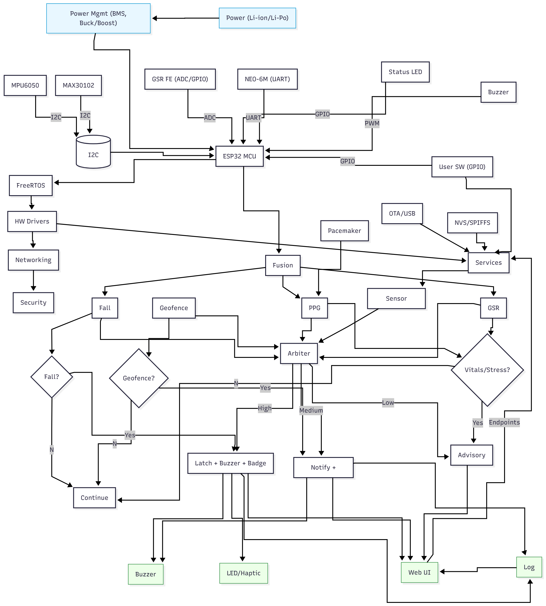
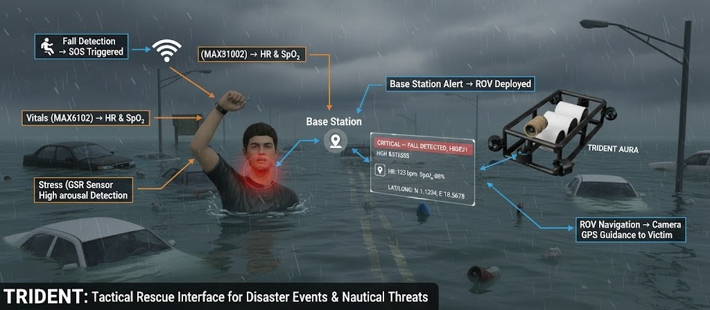

TRIDENT operates across three integrated layers:

### 📱 Smart Wearable (Edge Layer)
<p align="center">
  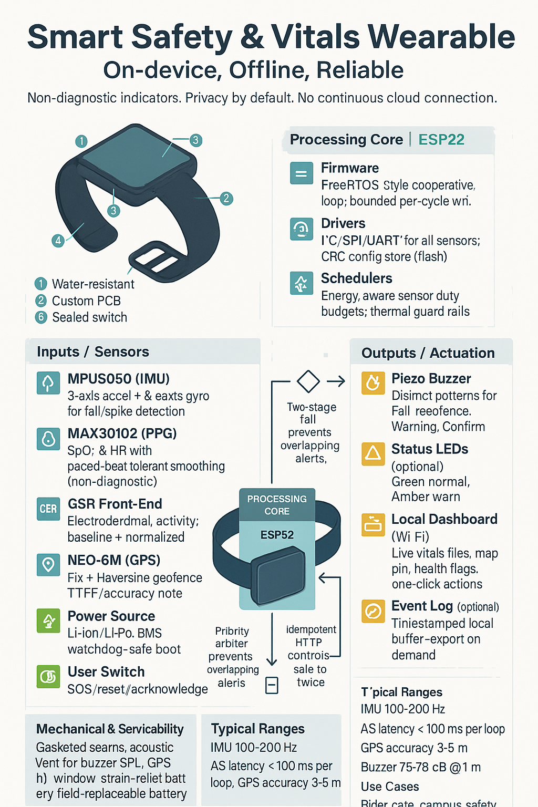
</p>

- ESP32-based embedded firmware with multi-sensor integration
- Real-time vital signs, motion, and GPS monitoring
- Edge-based emergency detection and alert generation

### 🖥️ Central Command Dashboard (Decision Layer)
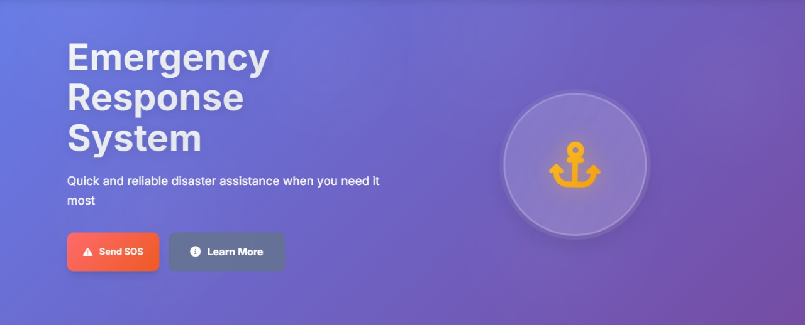

- Web-based emergency response coordination interface
- AI-powered priority classification and resource allocation
- Real-time visualization of incidents and response teams

**Live Telemetry Data Feed:**
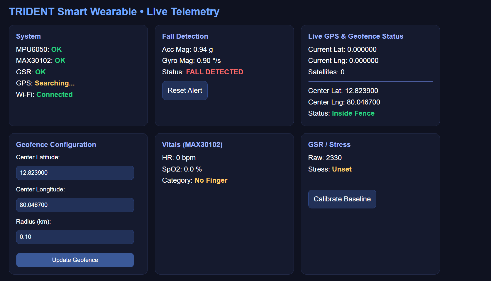

### 🚁 Autonomous ROV (Action Layer)
- Remote-controlled deployment system for emergency scenarios
- Sensor integration for environmental assessment
- Automated navigation to high-priority locations

## 🛠️ Hardware Engineering & Design

### Wearable Component
The wearable hardware was designed meticulously integrating multiple bio-sensors and embedded modules.
<p float="left">
  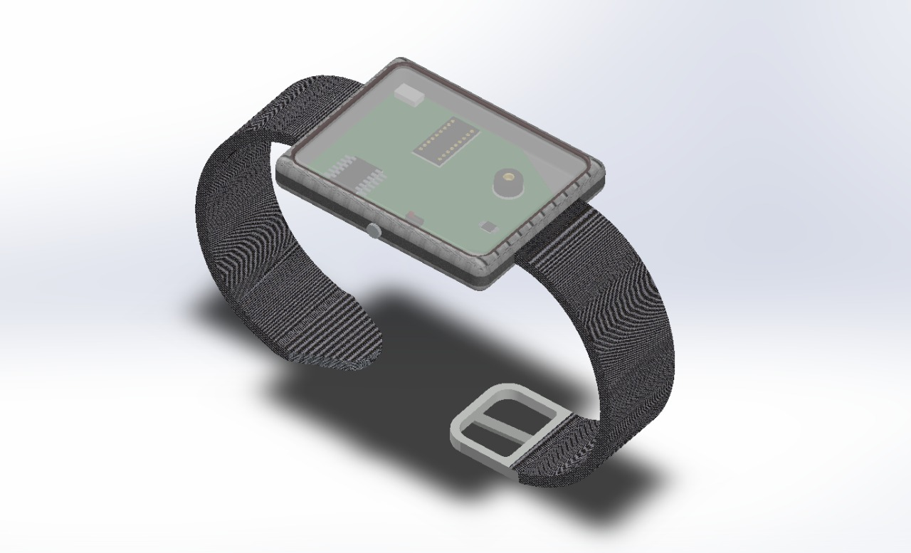
  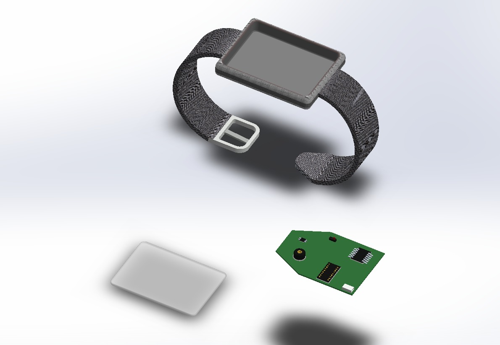
</p>
<p float="left">
  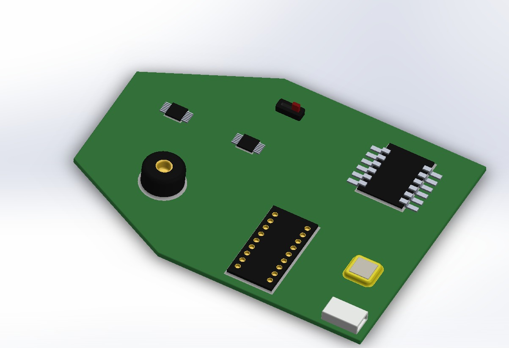
</p>

**CAD Flythrough:**
<video src="https://github.com/harshitworkmain/trident/raw/main/assets/videos/Wearable-cad.mp4" controls="controls" style="max-width: 100%;"></video>

### Autonomous ROV
The underwater ROV undergoes rigorous fluid dynamics analysis to ensure stability under water currents.
<p float="left">
  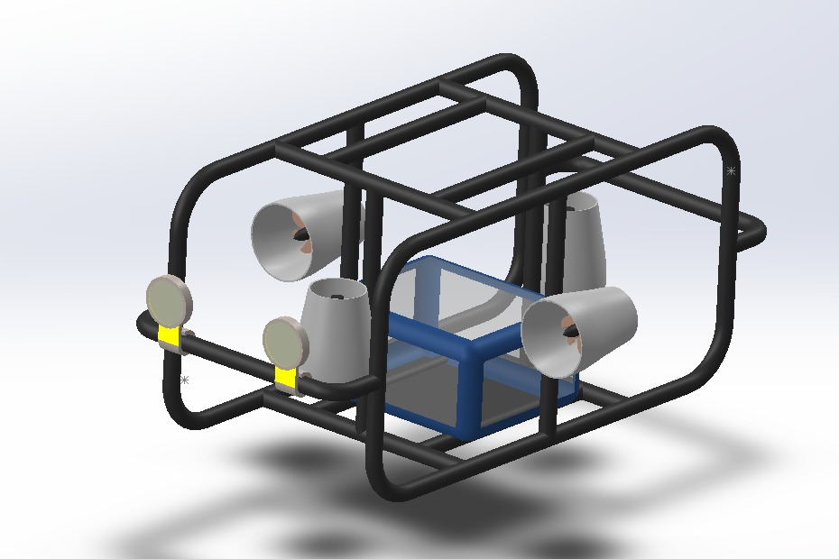
  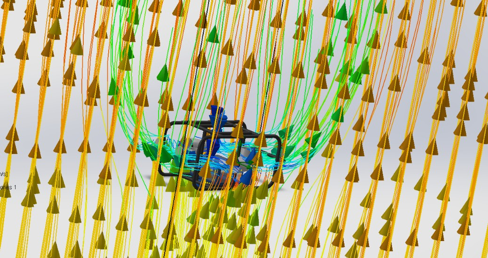
</p>

**ROV Field Deployment:**
<video src="https://github.com/harshitworkmain/trident/raw/main/assets/videos/finalrov.mp4" controls="controls" style="max-width: 100%;"></video>

## 🚀 Quick Start

### Prerequisites
- Python 3.7+
- Node.js 14+ (for frontend development)
- PlatformIO (for firmware development)
- Qt6 (for ROV control station)

### Installation

1. **Clone the repository**
   ```bash
   git clone <repository-url>
   cd trident
   ```

2. **Install Python dependencies**
   ```bash
   pip install -r requirements.txt
   ```

3. **Set up configuration**
   ```bash
   cp config/development.env.example config/development.env
   # Edit config/development.env with your settings
   ```

4. **Initialize database**
   ```bash
   python scripts/development/database_reset.py
   ```

5. **Start the backend server**
   ```bash
   python src/backend/main.py
   ```

6. **Access the dashboard**
   - Open browser to `http://localhost:5000`
   - Navigate to `/admin` for dashboard access

## 📁 Project Structure

```
trident/
├── src/                     # Source code
│   ├── firmware/           # ESP32 embedded firmware
│   ├── backend/            # Flask API server
│   ├── ml/                 # Machine learning models
│   ├── rov/                # ROV control system
│   └── frontend/           # Web interface
├── data/                   # Data files and models
├── docs/                   # Documentation
├── scripts/                # Utility scripts
├── assets/                 # Static resources (Images, Videos, CADs)
└── config/                 # Configuration files
```

## 🔧 Development Setup

### Backend Development
```bash
# Start development server
python src/backend/main.py

# Run tests
python -m pytest src/backend/tests/

# Database operations
python scripts/development/database_reset.py
python scripts/development/add_sample_data.py
```

### Firmware Development
```bash
# Flash ESP32
cd src/firmware
pio run --target upload

# Monitor serial output
pio device monitor
```

### Frontend Development
```bash
# Serve static files (development)
python -m http.server 8080 --directory src/frontend/static
```

### ROV Control
```bash
# Launch ROV control station
python src/rov/communication/serial_interface.py
```

## 🧠 Machine Learning Components

### Weather Prediction
- LSTM-based temperature forecasting
- Historical weather data analysis
- Real-time prediction API

### Risk Analysis
- Graph-based risk propagation modeling
- Flood network analysis
- Storm path prediction
- Geospatial risk zone mapping

## 📊 Key Features

### Emergency Detection
- **Fall Detection**: MPU6050 accelerometer analysis
- **Vital Signs Monitoring**: MAX30102 heart rate and SpO2
- **Stress Assessment**: GSR sensor integration
- **Location Tracking**: GPS with geofencing

### Priority Classification
- Automated severity scoring
- Multi-factor consideration (injuries, vulnerable populations)
- Resource availability optimization
- Real-time priority updates

### Response Coordination
- Team assignment and notification
- Status tracking and updates
- Resource deployment optimization
- Analytics and reporting

## 🚀 Deployment

### Development Environment
```bash
# Start all services
docker-compose up -d
```

### Production Deployment
```bash
# Using scripts
./scripts/deployment/start_app.sh

# Manual deployment
gunicorn -w 4 -b 0.0.0.0:5000 src.backend.main:app
```

## 🧪 Testing

### Backend Tests
```bash
# Run all tests
python -m pytest src/backend/tests/

# Specific test categories
python -m pytest src/backend/tests/test_api.py
python -m pytest src/backend/tests/test_priority_system.py
```

### ROV Integration Tests
```bash
python src/rov/tests/test_rov_integration.py
python src/rov/tests/test_rov_deployment.py
```

## 📖 Documentation

- [System Architecture](docs/SYSTEM_ARCHITECTURE.md)
- [Quick Start Guide](docs/QUICK_START.md)
- [API Documentation](docs/API_DOCUMENTATION.md)
- [ROV Operations](docs/ROV_OPERATIONS.md)
- [Deployment Guide](docs/DEPLOYMENT_GUIDE.md)
- [User Manual](docs/USER_MANUAL.md)

## 🤝 Contributing

1. Fork the repository
2. Create a feature branch (`git checkout -b feature/amazing-feature`)
3. Commit your changes (`git commit -m 'Add amazing feature'`)
4. Push to the branch (`git push origin feature/amazing-feature`)
5. Open a Pull Request

## 📄 License

This project is licensed under the MIT License - see the [LICENSE](LICENSE) file for details.

## 🆘 Emergency Contacts

- **General Emergency**: 100
- **Fire Department**: 101
- **Medical Emergency**: 108
- **Disaster Management**: 108

## 🧑‍🤝‍🧑 Meet the Team
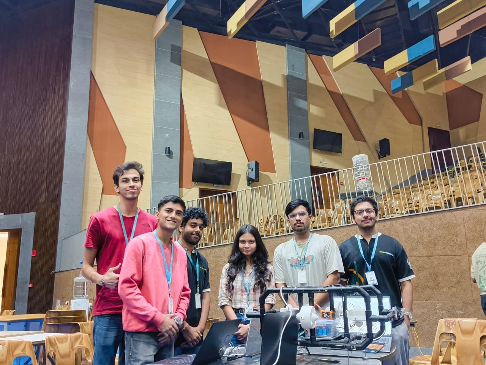

## 🔮 Future Enhancements

- **Mobile Applications**: iOS and Android apps for field operations
- **Advanced AI Integration**: Deep learning for emergency prediction
- **IoT Sensor Network**: Expanded environmental monitoring
- **Blockchain Integration**: Secure emergency records
- **Multi-language Support**: Localization for global deployment

---

**⚠️ Important**: This is an emergency response system. In case of real emergencies, always contact local emergency services directly using the numbers provided above.

**🛡️ TRIDENT - Your Shield in Times of Crisis**